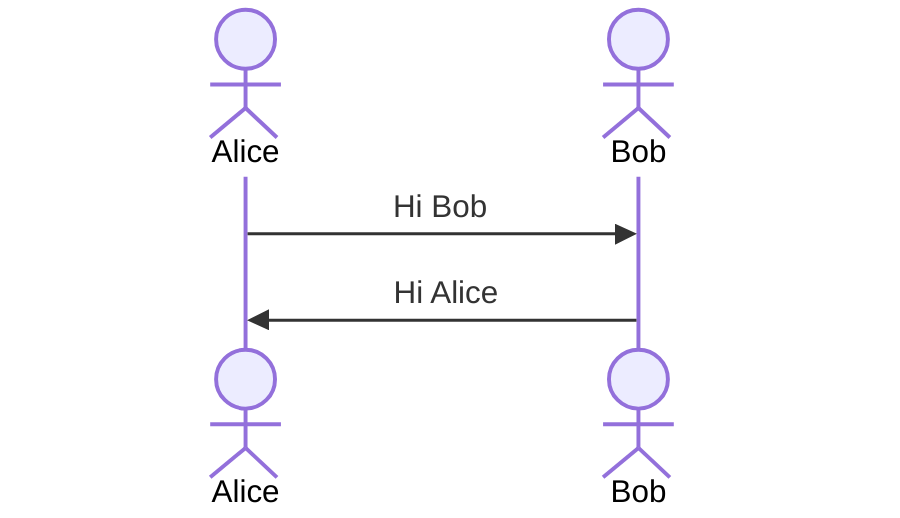

# DAY3~4: Omniverse issac sim 기반 commercial manipulator

-   *~~UR5e, Gripper 대상: 각각의 URDF 작성, Xacro 통합, Moveit에서 연동 Kinematics 구성 (3hr)~~*
-   *~~Moveit GUI 상에서 Controller 지정한 후 compile해주면 moveit_config(or UR5e_moveit_config 이런식으로 naming) 패키지 생성~~*

-   Moveit_servo는 원래 moveit package folder 내에 존재....

-   Conveyor belt 상의 object target obejct detect & picking/placing 공정 가상화(예제 찾아볼 것) task planning(target pose, goal pose)

-   Moveit pose tracker(출력?) -> Servo_server(여기서 제어 방법을 결정했던가???, trajectory_controller? group_controller) -> Joint twist? -> 1) Isaac sim simulator, 2) Rviz, 3) Real UR5e

-   Moveit 패키지에서 Jacobian matrix -> 공정최적화 프로그래밍(Manipulability measure 가시화, Optimal arm positioning)

## Joining two URDF(xacro)
### create new package and xacro file and including two other xacro
 - ROS workspace 내의 src에서 다음 명령어를 입력하여 새로운 패키지를 생성한다.
 
	   $ catkin_create_pkg ur5e_with_2f85_description
 - 아래 명령어를 통해 생성된 패키지 내에 `urdf`와 `launch` 디렉토리를 생성하고, `urdf` 디렉토리로 이동한다.
 
	    $ mkdir ur5e_with_2f85_description/launch ur5e_with_2f85_description/urdf
	    $ cd ur5e_with_2f85_description/urdf
	    
 - 생성된 `urdf` 디렉토리 내에서 아래 명령어를 입력해 `ur5e_with_2f85.xacro`파일을 만든다.

	   $ code ur5e_with_2f85.xacro
 - 열린 VScode에 아래의 코드를 붙여넣는다.

	   <?xml version="1.0"?>
		<robot name="ur5e_with_2f85" 
		  xmlns:xacro="http://wiki.ros.org/xacro">

		    <!-- 2f-85 -->
		    <xacro:include filename="$(find robotiq_2f_85_gripper_visualization)/urdf/robotiq_arg2f_85_model_macro.xacro" />
		    <xacro:robotiq_arg2f_85 prefix=""/>
		        
		    <!-- ur5e -->
		    <xacro:include filename="$(find ur_description)/urdf/inc/ur5e_macro.xacro" />
		    <xacro:ur5e_robot prefix="" />
		    
		    <link name="world"/>
		    
		    <joint name="world2base" type="fixed">
		        <parent link="world"/>
		        <child link="base_link"/>
		        <origin xyz="0 0 0" rpy="0 0 1.57" />
		    </joint>

		    <joint name="tool0To2f85" type="fixed">
		        <parent link="tool0"/>
		        <child link="robotiq_arg2f_base_link"/>
		        <origin xyz="0 0 0" rpy="0 0 1.57" />
		    </joint>

		</robot>

 - `Ctrl-S`로 저장 후 닫는다.
 - 위에서 만든 `launch` 디렉토리 내에서 아래 명령어를 입력하여 새로운 `load_ur5e_with_2f85.launch` 파일을 만든다.

      $ code load_ur5e_with_2f85.launch
 - 열린 VScode에 아래의 코드를 붙여넣는다.

      <?xml version="1.0"?>
		<launch>
		  <param name="robot_description" command="$(find xacro)/xacro '$(find new_robot_description)/urdf/ur5e_2f-85.xacro'"/>
		  <node pkg="robot_state_publisher" type="robot_state_publisher" name="robot_state_publisher"/>
		  <node pkg="joint_state_publisher_gui" type="joint_state_publisher_gui" name="joint_state_publisher_gui"/>
		  <node name="$(anon rviz)" pkg="rviz" type="rviz" respawn="false" output="screen"/>
		</launch>
 - `Ctrl-S`로 저장 후 닫는다.
 - `catkin_make`또는 `catkin build`후  아래  명령어를 통해 위에서 만든 `load_ur5e_with_2f85.launch` 파일을 실행한다.

	   $ roslaunch ur5e_with_2f85_description load_ur5e_with_2f85.launch 

 - 실행된 `Rviz`의 *Global Options*의 *Fixed Frame*을 `world`로 변경하고, *Add* 버튼을 눌러 *RobotModel*을 추가한다.
 - UR5e manipulator와 말단부에 장착된 2f-85 gripper를 확인할 수 있으며, 함께 실행된 `joint_state_publisher_gui`의 슬라이더를 움직여 각 joint의 값을 변경해 볼 수 있다.

### create movit_config package with moveit setup assistant
- 아래 명령어를 입력하여 `moveit_setup_assistant`를 실행한다.

	  $ roslaunch moveit_setup_assistant setup_assistant.launch
- *Create New MoveIt Configuration Package* 를 클릭하여 새로운 moveit config 패키지를 제작한다.
- *Load a URDF or COLLADA Robot Model*의 *Browse*를 클릭하여 앞서 제작한 `ur5e_with_2f85.xacro` 파일을 불러온 후  Load Files를 클릭한다.
- 우측의 *Viewer* 에서 불러온 모델을 확인한 후 좌측의 *Self-Collisions*를 클릭한다.
- 우측 상단의 *Generate Collision Matrix*를 클릭하고 *linear view*와  *matrix view*를 눌러 생성된 결과를 확인한다.
- 좌측 *Planning Groups*의 *Add Group*을 클릭하여 아래와 같이 입력한다.

- *Add Kin. Chain*을 클릭하고 좌측 하단의 *Expand All*을 클릭하여 모든 link가 보이게 한 후, 아래 그림과 같이 *Base Link*를 `base_link`로, *Tip Link*를 `tool0`로 설정한다.

- *Save*를 눌러 저장한 후 다시 *Add Group*을 눌러 아래와 같이 입력한다.

- *Add Joints*를 눌러 `finger_joint`를 선택한 후 오른쪽 화살표를 눌러 *Selected Joint*로 이동시키고, *Save*를 눌러 저장한다.
- 아래 그림과 같이 설정되었음을 확인한다.

- 좌측의 *Robot Poses*를 클릭하여 Robot의 predefined pose를 아래와 같이 추가한다.
- *Add Pose*를 누른 후 *Pose Name*을 `home`으로, *Planning Group*을 `manipulator`로 설정한  후 모든 joint 값이 `0`임을 확인하고 *Save*를 누른다.
- *Add Pose*를 누른 후 *Pose Name*을 `up`으로, *Planning Group*을 `manipulator`로 설정한  후, `shoulder_lift_joint` 값을 `-1.5708`로 변경하고, 나머지 모든 joint의 값이 `0`임을 확인하고 *Save*를 누른다.
- *Add Pose*를 누른 후 *Pose Name*을 `open`으로, *Planning Group*을 `gripper`로 설정한  후, `finger_joint` 값이 `0`임을 확인하고 *Save*를 누른다.
- *Add Pose*를 누른 후 *Pose Name*을 `close`로, *Planning Group*을 `gripper`로 설정한  후, `finger_joint` 값이 `0.8`임을 확인하고 *Save*를 누른다.
- 총 4개의 *Pose*가 아래와 같이 추가되었음을 확인한다.

- 좌측의 *End Effectors - Add End Effector*를 클릭하여 아래 그림과 같이 입력하고 *Save*를 눌러 저장한다.

- 좌측의 *Passive Joints*를 클릭하여 아래 그림과 같이 gripper의 나머지 조인트를 모두 Passive joint로 설정한다.

- 좌측의 *Controllers - Auto Add FollowJointsTraj*를 클릭하여 생성된 Controller의 이름과 Controller Type을 아래 그림과 같이 변경한다.

- 좌측의 *Author Information* 을 클릭하여 작성자의 정보를 입력한다.
- 좌측의 *Configulation Files*로 이동하여 *Configuration Package Save Path*를 ros workspace로 지정하고, 경로의 맨 뒤에 `/ur5e_with_2f85_moveit_config`를 붙여준다.

-  *Generate Package*를 클릭하여 `ur5e_with_2f85_moveit_config` 패키지를 생성한다.
- `catkin_make`또는 `catkin build`후 위에서 만든 패키지의 `demo.launch` 파일을 실행하여 moveit을 통해 manipulator를 제어해 본다.

## MoveIT Servoing

<!--stackedit_data:
eyJoaXN0b3J5IjpbLTg2MDM4NTk4NiwtMTYxOTMwODYwOCw4NT
c3MDQxMDEsMTk1MzM5ODk1NCwxMDUzNzkwOTk1LDE5NzU2NzU4
NzAsMzQzMTI4MzcsLTEzMzU5NTE2OTksODMzNTczODc5LDYzOT
Y0NTk1OSwyMTgzNjYyOTAsMTQwNzI3NDAxNSwtMTk5NjAxMzEz
MiwtMTMyNDc5NTQyMCw2MjczMDQwMjAsLTEyMTU0NjQwMTEsLT
EwOTI4OTc4NDgsLTg3NjExMjk5MywxODc2MDA4MDUxLDEyMzY2
OTM4ODVdfQ==
-->