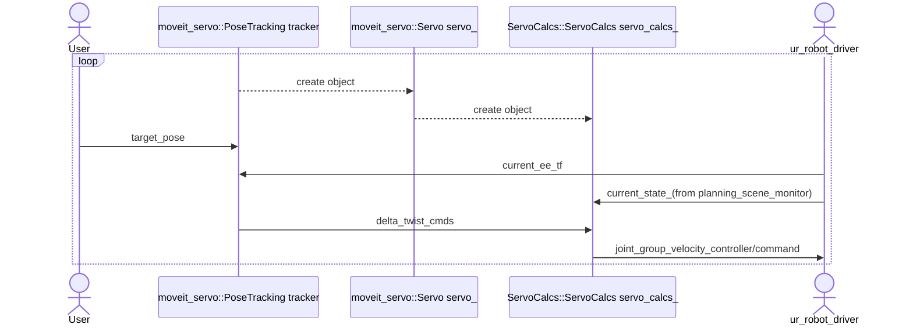

# DAY3~4: Omniverse issac sim 기반 commercial manipulator

-   *~~UR5e, Gripper 대상: 각각의 URDF 작성, Xacro 통합, Moveit에서 연동 Kinematics 구성 (3hr)~~*
-   *~~Moveit GUI 상에서 Controller 지정한 후 compile해주면 moveit_config(or UR5e_moveit_config 이런식으로 naming) 패키지 생성~~*

-   Moveit_servo는 원래 moveit package folder 내에 존재....

-   Conveyor belt 상의 object target obejct detect & picking/placing 공정 가상화(예제 찾아볼 것) task planning(target pose, goal pose)

-   Moveit pose tracker(출력?) -> Servo_server(여기서 제어 방법을 결정했던가???, trajectory_controller? group_controller) -> Joint twist? -> 1) Isaac sim simulator, 2) Rviz, 3) Real UR5e

-   Moveit 패키지에서 Jacobian matrix -> 공정최적화 프로그래밍(Manipulability measure 가시화, Optimal arm positioning)

- 필요한 패키지 준비

## Joining two URDF(xacro)
### create new package and xacro file and including two other xacro

- 필요한 패키지를 아래 주소에서 받아 빌드한다.
 
    
     **->모든 inertial 주석 제거 내용 추가 필요, 새로운 description repository로 교체 필요**
     
 - ROS workspace 내의 src에서 다음 명령어를 입력하여 새로운 패키지를 생성한다.
 
	   $ catkin_create_pkg ur5e_with_2f85_description
	   
 - 아래 명령어를 통해 생성된 패키지 내에 `urdf`와 `launch` 디렉토리를 생성하고, `urdf` 디렉토리로 이동한다.
 
	    $ mkdir ur5e_with_2f85_description/launch ur5e_with_2f85_description/urdf
	    $ cd ur5e_with_2f85_description/urdf
	    
 - 생성된 `urdf` 디렉토리 내에서 아래 명령어를 입력해 `ur5e_with_2f85.xacro`파일을 만든다.

	   $ code ur5e_with_2f85.xacro
 - 열린 VScode에 아래의 코드를 붙여넣는다.
 - **->gazebo plugin 및 self collision 추가 부분 작성 필요**
	```html
		<?xml version="1.0"?>
	  <robot name="ur5e_with_2f85" 
	    xmlns:xacro="http://wiki.ros.org/xacro">

	      <!-- 2f-85 -->
	      <xacro:include filename="$(find robotiq_85_description)/urdf/robotiq_85_gripper.urdf.xacro" />
	      <xacro:robotiq_85_gripper prefix="" parent="tool0">
	        <origin xyz="0.0 0.0 0.0" rpy="${pi/2} -${pi/2} 0" />
	      </xacro:robotiq_85_gripper>  
	          
	      <!-- ur5e -->
	      <xacro:include filename="$(find ur_description)/urdf/inc/ur5e_macro.xacro" />
	      <xacro:ur5e_robot prefix="" />
	      
	      <link name="world"/>
	      
	      <joint name="world2base" type="fixed">
	          <parent link="world"/>
	          <child link="base_link"/>
	          <origin xyz="0 0 0" rpy="0 0 1.57" />
	      </joint>
	      
	      <gazebo>
	        <plugin name="ros_control" filename="libgazebo_ros_control.so">
	          <!--robotNamespace>/</robotNamespace-->
	          <!--robotSimType>gazebo_ros_control/DefaultRobotHWSim</robotSimType-->
	        </plugin>
	      </gazebo>

	      <!-- Configure self collision properties per link -->
	      <gazebo reference="shoulder_link">
	        <selfCollide>true</selfCollide>
	      </gazebo>
	      <gazebo reference="upper_arm_link">
	        <selfCollide>true</selfCollide>
	      </gazebo>
	      <gazebo reference="forearm_link">
	        <selfCollide>true</selfCollide>
	      </gazebo>
	      <gazebo reference="wrist_1_link">
	        <selfCollide>true</selfCollide>
	      </gazebo>
	      <gazebo reference="wrist_3_link">
	        <selfCollide>true</selfCollide>
	      </gazebo>
	      <gazebo reference="wrist_2_link">
	        <selfCollide>true</selfCollide>
	      </gazebo>


	  </robot>
	```
 - `Ctrl-S`로 저장 후 닫는다.
 - 위에서 만든 `launch` 디렉토리 내에서 아래 명령어를 입력하여 새로운 `load_ur5e_with_2f85_demo.launch` 파일을 만든다.

       $ code load_ur5e_with_2f85_demo.launch
      
 - 열린 VScode에 아래의 코드를 붙여넣는다.
	```html
	<?xml version="1.0"?>
	<launch>
	  <param name="robot_description" command="$(find xacro)/xacro '$(find ur5e_with_2f85_description)/urdf/ur5e_with_2f85.xacro'"/>
	  <node pkg="robot_state_publisher" type="robot_state_publisher" name="robot_state_publisher"/>
	  <node pkg="joint_state_publisher_gui" type="joint_state_publisher_gui" name="joint_state_publisher_gui"/>
	  <node name="$(anon rviz)" pkg="rviz" type="rviz" respawn="false" output="screen"/>
	</launch>
	```
- `Ctrl-S`로 저장 후 닫는다.

- `launch` 디렉토리 내에서 아래 명령어를 입력하여 새로운 `load_ur5e_with_2f85.launch` 파일을 만든다.

       $ code load_ur5e_with_2f85.launch
      
 - 열린 VScode에 아래의 코드를 붙여넣는다.
	```html
	<?xml version="1.0"?>
	<launch>
	  <param name="robot_description" command="$(find xacro)/xacro '$(find ur5e_with_2f85_description)/urdf/ur5e_with_2f85.xacro'"/>
	</launch>
	```
- `Ctrl-S`로 저장 후 닫는다.
- `catkin_make`또는 `catkin build`후  아래  명령어를 통해 위에서 만든 `load_ur5e_with_2f85_demo.launch` 파일을 실행한다.

      $ roslaunch ur5e_with_2f85_description load_ur5e_with_2f85_demo.launch 

 - 실행된 `Rviz`의 *Global Options*의 *Fixed Frame*을 `world`로 변경하고, *Add* 버튼을 눌러 *RobotModel*을 추가한다.
 - UR5e manipulator와 말단부에 장착된 2f-85 gripper를 확인할 수 있으며, 함께 실행된 `joint_state_publisher_gui`의 슬라이더를 움직여 각 joint의 값을 변경해 볼 수 있다.

### create movit_config package with moveit setup assistant
- 아래 명령어를 입력하여 `moveit_setup_assistant`를 실행한다.

	  $ roslaunch moveit_setup_assistant setup_assistant.launch
- *Create New MoveIt Configuration Package* 를 클릭하여 새로운 moveit config 패키지를 제작한다.
- *Load a URDF or COLLADA Robot Model*의 *Browse*를 클릭하여 앞서 제작한 `ur5e_with_2f85.xacro` 파일을 불러온 후  Load Files를 클릭한다.
- 우측의 *Viewer* 에서 불러온 모델을 확인한 후 좌측의 *Self-Collisions*를 클릭한다.
- 우측 상단의 *Generate Collision Matrix*를 클릭하고 *linear view*와  *matrix view*를 눌러 생성된 결과를 확인한다.
- 좌측 *Planning Groups*의 *Add Group*을 클릭하여 아래와 같이 입력한다.


- *Add Kin. Chain*을 클릭하고 좌측 하단의 *Expand All*을 클릭하여 모든 link가 보이게 한 후, 아래 그림과 같이 *Base Link*를 `base_link`로, *Tip Link*를 `tool0`로 설정한다.


- *Save*를 눌러 저장한 후 다시 *Add Group*을 눌러 아래와 같이 입력한다.


- *Add Joints*를 눌러 `finger_joint`를 선택한 후 오른쪽 화살표를 눌러 *Selected Joint*로 이동시키고, *Save*를 눌러 저장한다.
- 아래 그림과 같이 설정되었음을 확인한다.

- 좌측의 *Robot Poses*를 클릭하여 Robot의 predefined pose를 아래와 같이 추가한다.
- *Add Pose*를 누른 후 *Pose Name*을 `home`으로, *Planning Group*을 `manipulator`로 설정한  후 모든 joint 값이 `0`임을 확인하고 *Save*를 누른다.
- *Add Pose*를 누른 후 *Pose Name*을 `up`으로, *Planning Group*을 `manipulator`로 설정한  후, `shoulder_lift_joint` 값을 `-1.5708`로 변경하고, 나머지 모든 joint의 값이 `0`임을 확인하고 *Save*를 누른다.
- *Add Pose*를 누른 후 *Pose Name*을 `open`으로, *Planning Group*을 `gripper`로 설정한  후, `finger_joint` 값이 `0`임을 확인하고 *Save*를 누른다.
- *Add Pose*를 누른 후 *Pose Name*을 `close`로, *Planning Group*을 `gripper`로 설정한  후, `finger_joint` 값이 `0.8`임을 확인하고 *Save*를 누른다.
- 총 4개의 *Pose*가 아래와 같이 추가되었음을 확인한다.


- 좌측의 *End Effectors - Add End Effector*를 클릭하여 아래 그림과 같이 입력하고 *Save*를 눌러 저장한다.


- 좌측의 *Passive Joints*를 클릭하여 아래 그림과 같이 gripper의 나머지 조인트를 모두 Passive joint로 설정한다.


- 좌측의 *Controllers - Auto Add FollowJointsTraj*를 클릭하여 생성된 Controller의 이름과 Controller Type을 아래 그림과 같이 변경한다.

- 좌측의 *Author Information* 을 클릭하여 작성자의 정보를 입력한다.
- 좌측의 *Configulation Files*로 이동하여 *Configuration Package Save Path*를 ros workspace로 지정하고, 경로의 맨 뒤에 `/ur5e_with_2f85_moveit_config`를 붙여준다.

-  *Generate Package*를 클릭하여 `ur5e_with_2f85_moveit_config` 패키지를 생성한다.
- `catkin_make`또는 `catkin build`후 위에서 만든 패키지의 `demo.launch` 파일을 실행하여 moveit을 통해 manipulator를 제어해 본다.

## Preparing Gazebo
- ROS workspace 내의 src에서 다음 명령어를 입력하여 새로운 패키지를 생성한다.
 
	   $ catkin_create_pkg ur5e_with_2f85_gazebo
	   
- config와 launch 디렉토리를 만들고, 

 	   $ cd ur5e_with_2f85_gazebo
 	   $ mkdir config launch
 	  
- VS code를 이용해 config 디렉토리 내에 ur5e_with_2f85_controllers.yaml 파일을 만들고, 

      $ code config/ur5e_with_2f85_controllers.yaml
    
- 내용은 아래와 같이 입력한다.
```
 joint_state_controller:
  type: joint_state_controller/JointStateController
  publish_rate: &loop_hz 500

pos_joint_traj_controller:
  type: position_controllers/JointTrajectoryController
  joints: &robot_joints
    - shoulder_pan_joint
    - shoulder_lift_joint
    - elbow_joint
    - wrist_1_joint
    - wrist_2_joint
    - wrist_3_joint
  constraints:
    goal_time: 0.6
    stopped_velocity_tolerance: 0.05
    shoulder_pan_joint: {trajectory: 0.1, goal: 0.1}
    shoulder_lift_joint: {trajectory: 0.1, goal: 0.1}
    elbow_joint: {trajectory: 0.1, goal: 0.1}
    wrist_1_joint: {trajectory: 0.1, goal: 0.1}
    wrist_2_joint: {trajectory: 0.1, goal: 0.1}
    wrist_3_joint: {trajectory: 0.1, goal: 0.1}
  stop_trajectory_duration: 0.5
  state_publish_rate: *loop_hz
  action_monitor_rate: 10

gripper_controller:
  type: position_controllers/JointTrajectoryController
  joints:
    - robotiq_85_left_knuckle_joint
  constraints:
    goal_time: 0.6
    stopped_velocity_tolerance: 0.05
    robotiq_85_left_knuckle_joint: {trajectory: 0.1, goal: 0.1}
  stop_trajectory_duration: 0.5
  state_publish_rate: *loop_hz
  action_monitor_rate: 10

joint_group_pos_controller:
  type: position_controllers/JointGroupPositionController
  joints: *robot_joints


과 launch 디렉토리 내에 ur5e_with_2f85_bringup.launch, ur5e_with_2f85_control.launch 파일을 만든다.
## MoveIT! Servoing


### 패키지 준비
- 필요한 패키지들을 아래 주소에서 받아 빌드한다.
    
   https://minhaskamal.github.io/DownGit/#/home?url=https://github.com/ros-planning/moveit/tree/master/moveit_ros/moveit_servo
      
- 다음 명령어를 workspace 디렉토리에서 실행한다.

      $ rosdep install --ignore-src --from-paths src -y

- 받은 `moveit_servo` 패키지의 `CmakeLists.txt` 파일을 열어 line 92에 한 줄을 띄우고 아래의 코드를 추가한다.

```cpp
add_executable(ur_pose_tracker
  src/ur_pose_tracker.cpp
)
add_dependencies(ur_pose_tracker ${catkin_EXPORTED_TARGETS})
target_link_libraries(ur_pose_tracker
  ${catkin_LIBRARIES}
  ${SERVO_LIB_NAME}
  pose_tracking
)
```		

- 그리고 line 149의 `spacenav_to_twist` 아래 한 줄을 띄우고 `ur_pose_tracker`를 추가한다.

- `moveit_servo`패키지의 src 디렉토리에 `ur_pose_tracker.cpp` 파일을, include 디렉토리에 `ur_pose_tracker.hpp`파일을 추가한다.
- 각각의 파일에 아래의 코드를 붙여넣는다.

    *[해당 코드 완성후 추가 필요](https://github.com/IROL-SSU/isaac_sim_tutorial_pkgs/blob/master/moveit_servo/src/ur_pose_tracker.cpp)*
    
- `config` 디렉토리 내의 `ur_simulated_config.yaml`을 복사하고 이름을 `ur_isaac_config.yaml`로 변경한다.
- 파일을 열고 아래의 코드와 같이 설정 파라이터들을 수정한다.

   	 *[해당 코드 완성후 추가 필요](https://github.com/IROL-SSU/isaac_sim_tutorial_pkgs/blob/master/moveit_servo/config/ur_isaac_config.yaml)*

**- config 폴더 내 ur5e_controllers.yaml 추가 및 수정내용 추가 필요**


## Gazebo 환경 구축


## ToDo list

- [ ] isaac sim의 ros extension중 joint state publisher를 통한 ur의 joint group pos(vel) controller 구동기능 구현
	- [ ] joint state를 controller로 전송
	- [ ] command의 joint state msg를 변경하여 isaac sim으로
- [ ] `ur_pose_tracker` 코드 완성

## 문제점


- Gazebo와 Real robot(ur_robot_driver)에는 `hardware_interface`가 작성되어 있으나, isaac sim에는 없음.

 ### 해결책
1. *~~isaac_sim에 대응하는 `hardware_interface` 작성(제어기능x, 단순 command, feedback(state) forward만)~~*

2. `hardware_interface`가 이미 작성된 gazebo/Real robot과 함께 사용하여 isaac sim은 해당 로봇의 state로만 움직이게 구현


4. ~~*isaac_sim 내 extension으로 해당 기능 구현하는 package 구현*~~
->gazebo plugin 및 self collision 추가 필요

### 시뮬레이션 실행
```bash

$ roslaunch ur_gazebo ur5.launch 
-> Real Robot의 역할로써 동작, 

$ roslaunch ur5_moveit_config ur5_moveit_planning_execution.launch sim:=true
-> ur5e_with_2f85 로 변경

$ roslaunch ur5_moveit_config moveit_rviz.launch config:=true
-> ur5e_with_2f85 로 변경

$ roslaunch moveit_servo spacenav_cpp.launch
-> isaac sim의 sensor data를 받아 계산한 target pose의 publisher로 변경

```

## Reference
- https://roscon.ros.org/2014/wp-content/uploads/2014/07/ros_control_an_overview.pdf
- https://classic.gazebosim.org/tutorials?tut=ros_control&cat=connect_ros
- http://wiki.ros.org/ros_control/Tutorials/Create%20your%20own%20hardware%20interface
- https://github.com/UniversalRobots/Universal_Robots_ROS_Driver/blob/master/ur_robot_driver/src/hardware_interface.cpp
- https://github.com/Toni-SM/semu.robotics.ros_bridge


<!--stackedit_data:
eyJoaXN0b3J5IjpbLTE3MTY4MjQ5MiwyMDIyNjczNjM0LC04Nz
cyMzYwNDEsMjA0MDIxMTM1NiwtMTQ0MDY1MjU1NiwxMzYxMDM1
MDk2LDIxMDY1MjYyNzksMjExNzY1MTk5NSwtNzc4MzY1Mjg1LC
0xODY4NjgwMTcxLC0yMDQ0NTg3ODMsLTEyOTkzMTE0MTUsLTE5
NzkwNzM2MTcsLTY3ODkyNDg5OSwtNTUxNzA3ODc2LDc3NjgwNT
U4OSwtMjA2NDY3MTI3OSwtMTI0NDIzMDg1OSwtMjc1MzA4Mjk2
LC04NTU4MzA5OF19
-->